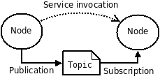

# ROS at a Conceptual Level

_Previous tutorial: [What is ROS?](1_what_is_ROS.md)_

Before we learn how to develop robotics applications with ROS, we need to understand the ROS architecture.

## Publisher/Subscriber Model

Probably the most common way of organizing software with ROS is through the [publish-subscribe pattern](https://en.wikipedia.org/wiki/Publish%E2%80%93subscribe_pattern).
This pattern relies on three key ideas:

1. Nodes
2. Topics
3. Messages

### Nodes

_More information about ROS Nodes can be found [here](https://wiki.ros.org/Nodes)._

A ROS _node_ is basically a process.
A node typically results from running an executable that is created from the code we write.
Nodes usually do one of the following (or both):

1. Process data received from a topic that the node is subscribed to
2. Generate data and share this data by publishing it to a topic

### Topics

_More information about ROS Topics can be found [here](https://wiki.ros.org/Topics)._

A ROS _topic_ can be viewed as a miniature data center.
Topics receive data from one or more nodes and share this data with any nodes that subscribe to this topic.
Topics allow for nodes to function independently of one another.
ROS nodes should work even if:

1. A node subscribes to a topic that receives no data
2. A node publishes data to a topic that has no subscribers

### Messages

_More information about ROS Messages can be found [here](https://wiki.ros.org/Messages)._

A ROS _message_ ia how data is represented when passed to/from topics.
Instead of using typical [primitive data types](https://en.wikipedia.org/wiki/Primitive_data_type) like `int`, `bool`, or `char` to represent data being passed throughout the ROS network, _message types_ are used.
These message types help encapsulate things like a robot's [pose](http://docs.ros.org/api/geometry_msgs/html/msg/Pose.html), which is too complex to define using a single primitive data type.

For more information on common ROS message types, take a look at the [common_msgs](https://wiki.ros.org/std_msgs) page.
It's important to note that all ROS messages are built on [std_msgs](https://wiki.ros.org/std_msgs), which represent primitive data types.

## Services

_More information about ROS Services can be found [here](https://wiki.ros.org/Services)._

For certain tasks, the [request-response](https://en.wikipedia.org/wiki/Request%E2%80%93response) approach is a better solution than the [publish-subscribe pattern](https://en.wikipedia.org/wiki/Publish%E2%80%93subscribe_pattern).
ROS _services_ can be used instead of publishers and subscribers in order to achieve request-response behavior.
A ROS _service_ involves a request and response: node A will send a request to node B, and then wait for node B's response.

It's important to note that services are _blocking_, so node A cannot do anything until it has received a response from node B.
Every service has an associated _service type_, which consists of a _request_ and _response_ message type.

For more information about topics vs services, take a look at this [guide](https://wiki.ros.org/ROS/Patterns/Communication#Communication_via_Topics_vs_Services_vs_X).

_A graphical depiction of nodes interacting through a topic and a service.
Note how the nodes do not communicate directly when publishing/subscribing to a topic, whereas the nodes communicate directly when executing a service._

## Parameters

_More information about ROS Parameters can be found [here](https://wiki.ros.org/Parameter%20Server)._

ROS _parameters_ are variables can be modified to affect the behavior of a node.
Parameters are stored in a _parameter server_, and nodes use this server to store and retrieve parameters at runtime.

Parameters are a good way to make nodes configurable so that a node's behavior can be changed without having to re-write and re-compile code.
An example use case of a parameter is the resolution of a map generated by SLAM.

## Master

_More information about the ROS Master can be found [here](https://wiki.ros.org/Master)._

The ROS _master_ is what glues together nodes within a program.
The master provides the parameter server, keeps track of which nodes publish and subscribe to which topics, and also manages services.

ROS nodes cannot run if the master is not running, so be sure to always start master first!

## Packages

_More information about ROS Packages can be found [here](https://wiki.ros.org/Packages)._

A ROS _package_ is analogous to a typical software package: it is a collection of source code that can be used to produce things like nodes, messages, or services.
Robotics applications that are built on ROS are typically composed of many different ROS packages.
ROS packages that you create should be [modular](https://en.wikipedia.org/wiki/Modular_programming), which is why you'll often see things like message or services types represented in their own package.

## Workspaces

A _workspace_ is simply a location on your machine that contains one or more packages.
Workspaces are typically used to represent a project and its dependencies: for example, if you were working on something related to computer vision, you may have a workspace named `vision` with packages for things like perception and localization.
Workspaces are useful because you can build all of the packages in a workspace at once, which allows for isolation between projects and an easy way to automate software production/testing.

## Catkin

_More information about Catkin can be found [here](https://wiki.ros.org/catkin)._

_Catkin_ is the build system for ROS 1.
It is based on [CMake](https://cmake.org/) and simplifies building packages that have other ROS package dependencies.
Whenever we want to build a ROS package that we have written, we will use catkin.

There are several build tools that can be used to help build packages in a workspace with catkin.
Before we discuss the tools that are available to us and which ones are preferred, let's go over the difference between a build _system_ and build _tool_.

A build tool is used to help build a set of packages.
The tool's job is to determine the dependency graph between packages so that packages are built in the right order.
For example, if a workspace has two packages, A and B, with package A having a dependency on package B, then the build tool can be used to figure out that package B needs to be built before building package A.
Once the build order has been determined, the build tool then invokes the build system on each package in that order. So, what is a build system?

A build system is what actually operates on a single package to produce things like executables or libraries.
Some example build systems include [CMake](https://cmake.org/), [Make](https://www.gnu.org/software/make/manual/make.html), and [Autotools](https://en.wikipedia.org/wiki/GNU_Autotools).

So, to recap:
* ROS packages need to be built in order to use them
* ROS packages have dependencies, which can be ROS or non-ROS packages (an example non-ROS package dependency may be [OpenCV](https://opencv.org/))
* A package cannot be built until all of its dependencies are built
* A build tool can be used to determine the order in which packages should be built
* Once the build order has been determined, the build system must operate on each package in order to build all of the code in a workspace

Build tools are nice because they automate the build process for us - all we need to do is call the build tool, and then wait for the packages to be built!

So, what build tools are available for ROS packages, and which one should we use?
There are three build tools that are good to know about for ROS 1.
Don't worry about _how_ to use these build tools just yet; we will go over this later.

1. `catkin_make`
    * The first tool created for building catkin workspaces
    * Invokes CMake only a single time, which allows for packages in a workspace to be built in parallel if possible
    * Can't process plain CMake packages
2. `catkin_make_isolated`
    * Processes packages sequentially and can process plain CMake packages
    * Slower build time since packages are not built in parallel
3. `colcon`
    * Can build packages in parallel
    * Can build any kind of package (catkin, CMake, etc.) on Linux, macOS and Windows
    * The default build tool for [ROS 2](https://index.ros.org/doc/ros2/), so it is "future-proof"

With these distinctions in mind, I recommend using `colcon` whenever possible since this is the build tool that will be used for ROS 2.
`Colcon` is designed to support ROS 1 packages as well, and has the advantage over `catkin_make_isolated` of building packages in parallel.
If you cannot use colcon to build packages that you are using, then I would suggest `catkin_make_isolated` over `catkin_make` since it is more robust.

_If my explanation of ROS build systems and build tools didn't make sense, or if you just want to learn more about this topic, I recommend reading the [colcon motivation article](https://design.ros2.org/articles/build_tool.html) and/or this quick [explanation](https://answers.ros.org/question/320613/catkin_make-vs-catkin_make_isolated-which-is-preferred/) of catkin_make vs catkin_make_isolated._

## Next Tutorial

[Commandline Tools](./3_commandline_tools.md)