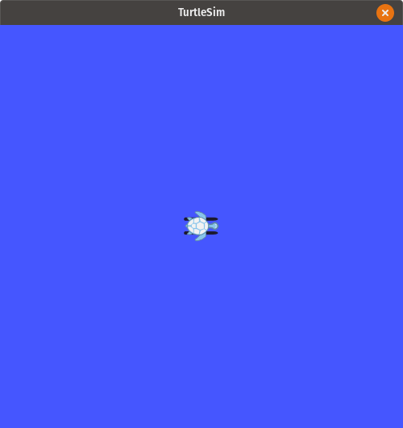
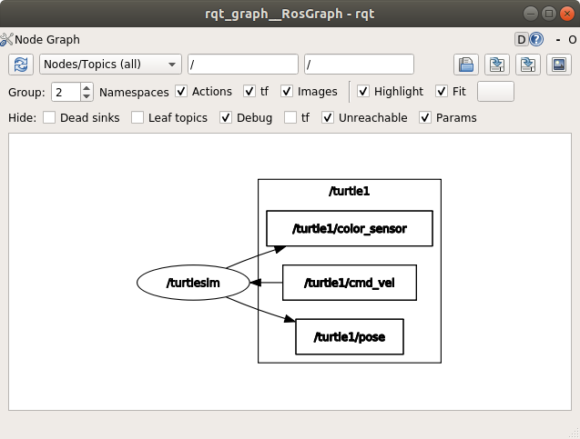
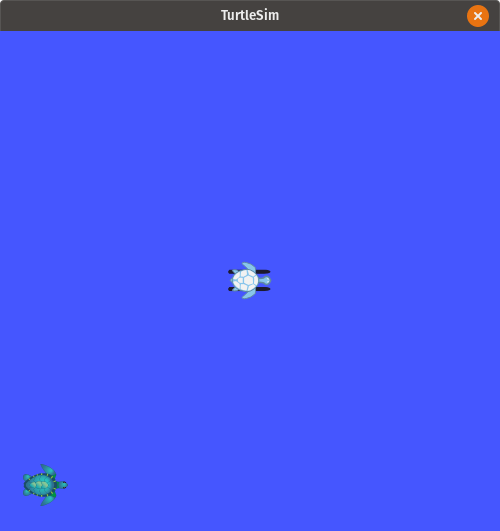
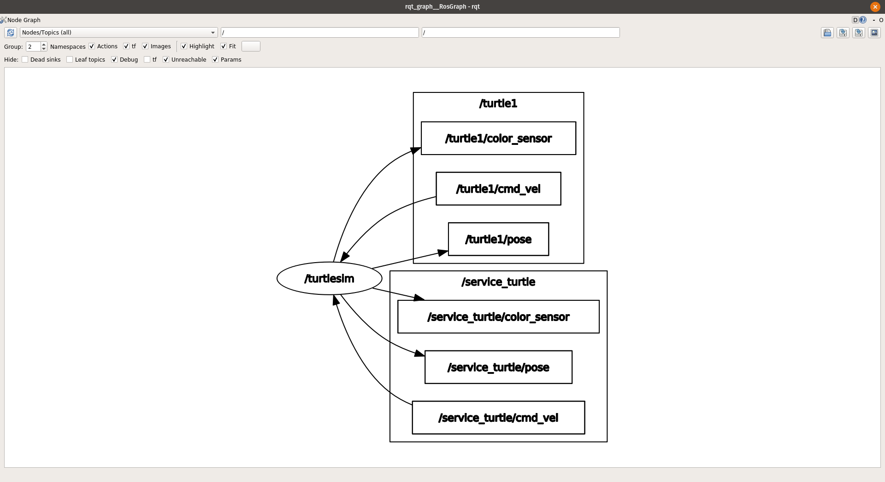

# Commandline Tools

_Previous tutorial: [ROS at a Conceptual Level](./2_ROS_conceptual_level.md)_

Before we get into common usage of ROS commandline tools, you'll need to have gone through the [ROS Docker setup](../docker/README.md).
If you have not done this yet, please take a moment to do so now.

Once you have built the docker image, let's go ahead and start a container.
We don't have any packages to load into the container right now, so you can set the path to anything you'd like. I'll use `~/` for simplicity:

```
$ cd <PATH_TO_REPO>/docker
$ ./run_container.bash ~/
```

_The rest of the commands in the following tutorials should be run in the Docker container (unless explicitly stated otherwise).
If you need to open another shell in the container, remember that you can run `join.bash`:_

```
# open a new terminal
$ cd <PATH_TO_REPO>/docker
$ ./join.bash
```

## roscore

_More information about `roscore` can be found [here](https://wiki.ros.org/roscore)._

As mentioned [previously](./2_ROS_conceptual_level.md#master), we cannot run any ROS programs if the ROS master is not running. The `roscore` command can be used to start the ROS master:

```
$ roscore
```

You should see output similar to the following:

```
... logging to /home/dev/.ros/log/ded22f2c-9a5d-11ea-9820-0242ac110002/roslaunch-fd2881773ac7-63.log
Checking log directory for disk usage. This may take a while.
Press Ctrl-C to interrupt
Done checking log file disk usage. Usage is <1GB.

started roslaunch server http://fd2881773ac7:36713/
ros_comm version 1.14.5


SUMMARY
========

PARAMETERS
 * /rosdistro: melodic
 * /rosversion: 1.14.5

NODES

auto-starting new master
process[master]: started with pid [73]
ROS_MASTER_URI=http://fd2881773ac7:11311/

setting /run_id to ded22f2c-9a5d-11ea-9820-0242ac110002
process[rosout-1]: started with pid [84]
started core service [/rosout]
```

## rosrun

_More information about `rosrun` can be found [here](https://wiki.ros.org/rosbash#rosrun)._

Now that the ROS master is running, we can start a ROS node (i.e., process).
This can be done with the `rosrun` command.
Leave the ROS master running, open another shell in the Docker container, and enter the following to learn more about `rosrun`:

```
$ rosrun --help
```

As we can see, `rosrun` needs two arguments:
1. A ROS package
2. An executable in this ROS package

Let's run the `turtlesim_node` executable in the `turtlesim` package (this package was installed as a part of the Docker image):

```
$ rosrun turtlesim turtlesim_node
```

You should see a simulator window with a turtle in it.



_The turtlesim simulator._

If you'd like to actually move this turtle around in the simulator window, you can do so by running the `turtle_teleop_key` executable, which is also a part of the `turtlesim` package.
Enter the following command in a separate terminal (be sure to leave the simulator and `roscore` running):

```
$ rosrun turtlesim turtle_teleop_key
```

## rqt_graph

_More information about the `rqt` metapackage (which includes `rqt_graph`) can be found [here](https://wiki.ros.org/rqt)._

The `rqt` ROS metapackage provides a set of GUI tools that are useful for debugging and/or developing ROS programs.
Let's discuss one of the more commonly used tools: `rqt_graph`.

`Rqt_graph` is a great way to visualize how nodes and topics interact with each other.
Make sure that you still have the ROS master and turtlesim simulator running, and run the following in another shell:

```
$ rqt_graph
```

Modify the settings in the GUI to match the image shown below.
We can now see that by running the `turtlesim_node` executable from the `turtlesim` package, we have created a node called `/turtlesim` that subscribes to the topic `/turtle1/cmd_vel` and publishes to the topics `/turtle1/pose` and `/turtle1/color_sensor`.



_The resulting rqt_graph from running the `turtlesim_node` executable.
Note how nodes are ovals, and topics are rectangles._

## rosnode

_More information about `rosnode` can be found [here](https://wiki.ros.org/rosnode)._

Although `rqt_graph` is a great way to visualize how nodes and topics interact, it doesn't provide us with much detailed information for the nodes displayed in the GUI.
If we want to learn more about the current nodes that are a part of a ROS program, we can use `rosnode`.

Let's get a list of the nodes that are currently running. Open another shell (keep running the ROS master, simulator and rqt_graph) and enter the following:

```
$ rosnode list
```

You should see output similar to this:

```
/rosout
/rqt_gui_py_node_725
/turtlesim
```

This means that we have three nodes currently running.
`/turtlesim` and `/rqt_gui_py_node_725` come from running `turtlesim_node` and `rqt_graph`, respectively.
`/rosout` is a node that always runs during a ROS program, and is used for logging purposes.
More information on `rosout` can be found [here](https://wiki.ros.org/rosout).

If we want to get more information about one of the nodes given by `rosnode list`, we can use `rosnode info`.
Let's learn a little more about the `/turtlesim` node by running the following command:

```
$ rosnode info /turtlesim
```

We are provided with the topics this node publishes/subscribes to (along with the associated message types), as well as the services associated with this node (we will re-visit services later):

```
--------------------------------------------------------------------------------
Node [/turtlesim]
Publications:
 * /rosout [rosgraph_msgs/Log]
 * /turtle1/color_sensor [turtlesim/Color]
 * /turtle1/pose [turtlesim/Pose]

Subscriptions:
 * /turtle1/cmd_vel [unknown type]

Services:
 * /clear
 * /kill
 * /reset
 * /spawn
 * /turtle1/set_pen
 * /turtle1/teleport_absolute
 * /turtle1/teleport_relative
 * /turtlesim/get_loggers
 * /turtlesim/set_logger_level


contacting node http://fd2881773ac7:34969/ ...
Pid: 668
Connections:
 * topic: /rosout
    * to: /rosout
    * direction: outbound (44469 - 172.17.0.2:58030) [15]
    * transport: TCPROS
```

Notice that the message type for the `/turtle1/cmd_vel` topic is unknown.
This is because no messages have been published to this topic yet, so the ROS master does not know what message type is associated with this topic yet.
We will go over how to publish messages to a topic later.

## rostopic

_More information about `rostopic` can be found [here](https://wiki.ros.org/rostopic)._

Just like `rosnode`, `rostopic` is a tool that can be used to get detailed information about topics in a ROS program.

Let's get a list of the topics that are currently being published or subscribed to.
In the same shell where we entered the `rosnode` commands, enter the following:

```
$ rostopic list
```

There are 6 topics running in our current setup:

```
/rosout
/rosout_agg
/statistics
/turtle1/cmd_vel
/turtle1/color_sensor
/turtle1/pose
```

To get more information about a current topic, we can use `rostopic info`.
Let's get more information about the `/turtle1/pose` topic:

```
$ rostopic info /turtle1/pose
```

We are provided with the topic's message type, publishers, and subscribers:

```
Type: turtlesim/Pose

Publishers:
 * /turtlesim (http://fd2881773ac7:34969/)

Subscribers: None
```

We can also see if any messages are currently being published to a topic via `rostopic echo`.
Let's see if any messages are being sent to the `/turtle1/color_sensor` topic:

```
$ rostopic echo /turtle1/color_sensor
```

You should see some output that defines the simulator colors (you can stop viewing these messages by entering `ctrl-c`):

```
...

r: 69
g: 86
b: 255
---
r: 69
g: 86
b: 255
---
r: 69
g: 86
b: 255
---
r: 69
g: 86
b: 255
---

...
```

`rostopic` can also be used to publish messages to topics!
Here's some information on how to publish messages with `rostopic`:

```
$ rostopic pub -h
Usage: rostopic pub /topic type [args...]

Options:
  -h, --help            show this help message and exit
  -v                    print verbose output
  -r RATE, --rate=RATE  publishing rate (hz).  For -f and stdin input, this
                        defaults to 10.  Otherwise it is not set.
  -1, --once            publish one message and exit
  -f FILE, --file=FILE  read args from YAML file (Bagy)
  -l, --latch           enable latching for -f, -r and piped input.  This
                        latches the first message.
  -s, --substitute-keywords
                        When publishing with a rate, performs keyword ('now'
                        or 'auto') substitution for each message
  --use-rostime         use rostime for time stamps, else walltime is used
```

As we can see, we need to know the name of the topic we are publishing to, along with the message type for that topic.

Let's make the turtle move by publishing a message to the `/turtle1/cmd_vel` topic.
We can use `rostopic info` again to know what message type this topic uses:

```
$ rostopic info /turtle1/cmd_vel
```

The output of this command tells us that this topic works with messages of type `geometry_msgs/Twist`.
The following command publishes a `geometry_msgs/Twist` message to the `/turtle1/cmd_vel` topic (you should see the turtle move once this message has been published):

```
$ rostopic pub /turtle1/cmd_vel geometry_msgs/Twist "linear:
  x: 1.0
  y: 1.0
  z: 0.0
angular:
  x: 0.0
  y: 0.0
  z: 0.0"
```

## rosmsg

_More information about `rosmsg` can be found [here](https://wiki.ros.org/rosmsg)._

Using `rosnode` and `rostopic` provide us with the message types associated with nodes and topics.
If we'd like to learn more about a certain message type, we can use `rosmsg`.

When we ran `rostopic info /turtle1/pose` above, we learned that the `/turtle1/pose` topic is receiving and sending messages of type `turtlesim/Pose`.
We can use `rosmsg show` to learn more about this message type:

```
$ rosmsg show turtlesim/Pose
```

We're provided with the data fields (or variables) that make up this message:

```
float32 x
float32 y
float32 theta
float32 linear_velocity
float32 angular_velocity
```

## rosservice

_More information about `rosservice` can be found [here](https://wiki.ros.org/rosservice)._

The `rosservice` command allows us to make service calls from the command line.
To see what services are available with the `turtlesim` node we are using, run the following command:

```
$ rosservice list
```

We are provided with a list of services we can call:

```
/clear
/kill
/reset
/rosout/get_loggers
/rosout/set_logger_level
/spawn
/turtle1/set_pen
/turtle1/teleport_absolute
/turtle1/teleport_relative
/turtlesim/get_loggers
/turtlesim/set_logger_level
```

We can use `rosservice info` to learn more about a service we are interested in.
Let's learn more about the `/spawn` service:

```
$ rosservice info /spawn
```

The output shows that this service is associated with the `/turtlesim` node, and requires 4 arguments: `x y theta name`.

```
Node: /turtlesim
URI: rosrpc://57326c7e6b3f:55733
Type: turtlesim/Spawn
Args: x y theta name
```

Let's actually call this service to test it:

```
$ rosservice call /spawn 1 1 0 service_turtle
```

Once the service has been completed, we are given a message in the terminal with the result:

```
name: "service_turtle"
```

Let's take a look at how our simulator looks now:



As we can see, our call to the `/spawn` service created another turtle in the simulator.
We can also verify this by re-visiting the shell where we called `rosrun`:

```
[ INFO] [1590343690.221263518]: Spawning turtle [service_turtle] at x=[1.000000], y=[1.000000], theta=[0.000000]
```

Now that we have two turtles running, let's run `rqt_graph` again to see how our nodes and topics are set up now:



Let's try one more thing with services.
Call the `/spawn` service again.
You can sey `x y theta` to anything you'd like, but make sure you use `service_turtle` for the `name` argument again:

```
$ rosservice call /spawn 2 5 .5 service_turtle
```

Based on the output of this call, it looks like the service failed this time (do you know why?):

```
ERROR: service [/spawn] responded with an error:
```

If we go back to the shell where we called `rosrun`, the following message gives us more information that explains why our second service call failed:

```
[ERROR] [1590344304.506419786]: A turtled named [service_turtle] already exists
```

## rossrv

_More information about `rossrv` can be found [here](https://wiki.ros.org/action/show/rosmsg?action=show&redirect=rossrv#rossrv)._

As previously mentioned, messages have message types, and services have service types.
The `rossrv` command can be used to learn more about the data types associated with a service type.

Running `rossrv list` gives us a list of all of the service types for every single package installed on our system.
This command will produce a lot of output for packages you may not be familiar with yet, so let's just focus on the service types for the `turtlesim` package:

```
turtlesim/Kill
turtlesim/SetPen
turtlesim/Spawn
turtlesim/TeleportAbsolute
turtlesim/TeleportRelative
```

Since we are already familiar with the `/spawn` service, let's use `rossrv show` to get a more detailed view of this service's type:

```
$ rossrv show turtlesim/Spawn
```

The output of this command is shown below.
Most of this looks familiar to us: when we called this service earlier, we had to provide it with the `x y theta name` parameters.
But why is there another name listed at the end (after `---`)?

```
float32 x
float32 y
float32 theta
string name
---
string name
```

The reason why there are two groups of data fields (separated by `---`) is because ros services follow the request-reponse architecture, as discussed in the [previous tutorial](./2_ROS_conceptual_level.md#services).
So, when we run `rossrv show`, we are provided with the request and response fields, which are separated by `---`.
When we run `rosservice call`, we are running the service request, so we need to provide the request object (which, in this case, is `x y theta name`).
Once the service has completed, we are provided with the response object, which is just `name` in the case of the `/spawn` service.

## rosparam

_More information about `rosparam` can be found [here](https://wiki.ros.org/rosparam)._

The `rosparam` command can be used to view and modify the contents of the parameter server.
We won't spend much time on parameters right now, but let's at least take a look at what we can do with the `rosparam` command:

```
$ rosparam -h
rosparam is a command-line tool for getting, setting, and deleting parameters from the ROS Parameter Server.

Commands:
	rosparam set	set parameter
	rosparam get	get parameter
	rosparam load	load parameters from file
	rosparam dump	dump parameters to file
	rosparam delete	delete parameter
	rosparam list	list parameter names
```

## roscd & rosls

_More information about `roscd` can be found [here](https://wiki.ros.org/rosbash#roscd).
More information about `rosls` can be found [here](https://wiki.ros.org/rosbash#rosls)._

Sometimes, you need to view or modify the contents of a ROS package. The `roscd` and `rosls` commands can help you find where a ROS package lives on your filesystem.

`roscd` is just like the `cd` command; it will change your directory to the directory where a ROS package's files are installed. Let's use this command to see where the `turtlesim` package is:

```
$ roscd turtlesim
$ pwd
```

As we can see, the turtlesim package is located in `/opt/ros/melodic/share/turtlesim` on our filesystem. While we are in this directory, let's see what is in it:

```
$ ls
cmake  images  msg  package.xml  srv
```

Now, go back to the home directory of your container (just enter `cd`), and run the following command:

```
$ rosls turtlesim
```

What do you notice about the output of the `rosls` command?
It matches the output of `ls` when we were in the `turtlesim` package directory!
So, `rosls` can be used to view the contents of a package without actually being in the directory where the package files exist.

## Next Tutorial

[Creating a ROS Package](./4_creating_ROS_package.md)